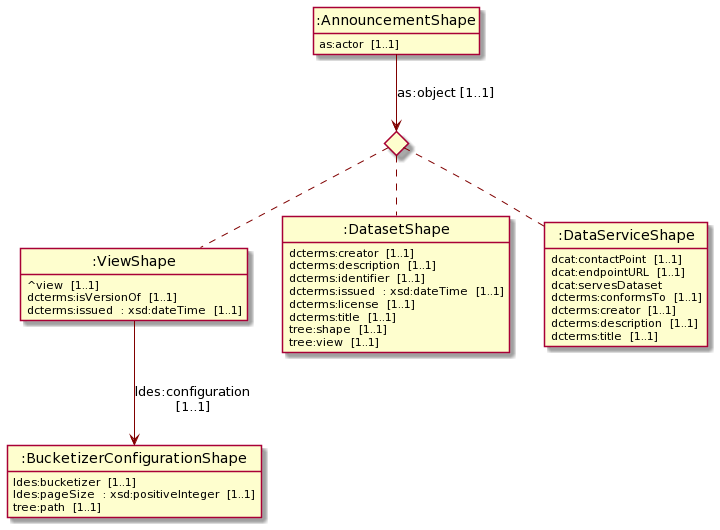

# Curation dashboard

## Setting up the dashboard

First clone the repository. Then go to the directory of the repository and install the packages.

```bash
npm install
```

Now, you can run the dashboard and start creating your own catalog of datasets by using following command.

```bash
npm run dev
```

### Deployment

```bash
npm run build
npm run start
```

## Using the dashboard

First you have to log in using your WebID and password with a valid solid Identity provider (IDP) such as [https://broker.pod.inrupt.com ](https://broker.pod.inrupt.com) or your own IDP using your self hosted [Solid Community Server](https://github.com/solid/community-server).

### Configuration

When the log in was successful, a page will be loaded with three fields to configure the curation of DCAT AP announcements:

* **The Announcement LDES URL**: This URL is the base LDP Container of **announcement LDES in LDP**. An example of such an LDES can be seen using this [link](https://tree.linkeddatafragments.org/announcements/). 

* **The Synchronized URL**: An URL that points to the base LDP Container of **the state of curation**.[^fn1]

* **The Curated LDES URL**: An URL that points to the base LDP Container of **the curated metadata catalog of DCAT datasets, dataservices or TREE views**. [^fn1]


[^fn1]: When the LDP is a solid pod, the WebID used during logging in MUST have an ACL:Write grant to this LDP container.

### Curation

Once those URLs are configured, click on the tab `Announcements` and the curation process can begin. 

All the announcements of the announcement LDES in LDP will be visualised with core info and you can pick whether you want the given object in your federated metadata catalog (stored in the curated LDES) or not.

Accepting results obviously in adding the object to the catalog and rejecting the object results in not being able to see that announcement anymore in the dashboard as you were not interested in that one.

Note that while accepting/rejecting announcements, the original announcement LDES will not be changed. This is of course the expected behaviour of an LDES as all the members are immutable and accepting/rejecting only apply changes on the state of curation and the possibility of making the curated LDES grow in size.

### Dev Mode

Activating this mode is done in the configuration tab. When activated a new tab appears, namely the development tab. Furthermore a third button appears at each announcement which perfoms a hyperlink action to go the source of the announcement.

In the Development tab, there are two kind of actions that can be executed:

* Creating announcements (all the three types)
* Creating an announcement LDES in LDP

#### Creating announcements

Each type of object can be edited to match the metadata of your dataset, service or view that you want to announce. 

When click the `create view` button, an announcement will be sent to the Announcement LDES URL and thus it will be added to the LDES. The newly created view can then be curated just like all the other announcements already present in the announcement LDES.

#### Creating an announcement LDES in LDP

The shape, SHACL path and type of relation can be edited in order to create any general LDES in LDP. 

Furthermore the location of where the announcement LDES in LDP will be created can also be edited, more specifically that location is the Announcement LDES URL (and can this be edited in the configuration tab).

Finally, creating this container requires ACL:Control permission for the WebID logged in to the dashboard to the LDP Container that will host the new LDES in LDP, when solid is used as an LDP.

Thus if the Announcement LDES URL is `https://localhost:3050/announcements`, the container `https://localhost:3050/` and the WebID `https://pod.inrupt.com/woutslabbinck/profile/card#me`. The ACL Resource should have as **agent** that WebID and as **mode** acl:control as shown in the following example.

```
@prefix acl: <http://www.w3.org/ns/auth/acl#> .

<localhost:3050/new#orchestrator>
  a acl:Authorization ;
  acl:accessTo <localhost:3050/> ;
  acl:agent <https://pod.inrupt.com/woutslabbinck/profile/card#me> ;
  acl:default <localhost:3050/> ;
  acl:mode acl:Control .
```

### Hosting your own announcement LDES on a solid server

Hosting an LDES in LDP adds a few requirements to an LDP:

* shape support is required
* Editing the metadata for an LDP container is required, more specifically the following predicates
  * ldp:inbox
  * ldp:contrainedBy

Luckily, there is already a branch that provides these functionalities: [shape support CSS](https://github.com/woutslabbinck/community-server/tree/feat/shape-support). This branch is forked from the Solid Community Server and edited such that when adding a `<containerURI> ldp:constrainedby <shapeURL>` predicate to the metadata of container, results in that only resources can be posted to that container which conform to the given shape.

The npm package [LDES orchestrator](https://www.npmjs.com/package/@treecg/ldes-orchestrator) contains functions that create an LDES in LDP with that type of solid server in mind and keep it scalable using the orchestrator, which is just a service that creates a new container (relation in the LDES) and edits some metadata when the current inbox is deemed to be full.

#### Server setup

```bash
git clone git@github.com:woutslabbinck/community-server.git
cd community-server

npm install
npm i jsonld-streaming-parser
# The latest version of jsonld-streaming-parser is required for adding a context to the reverse property in JSON-LD (used in creating View Announcements)

# go to the shape-support branch
npm checkout feat/shape-support

# initialize the server
node ./bin/server.js -c .config/file.json -f ./data -l info
```


Now you can go to `https://localhost:3000` and finish the initialisation process. After that process in the `data` directory the `.acl` file has to be edited to add your WebID as an acl:agent with acl:control permissions see [acl config example](creating-an-announcement-ldes-in-ldp). 

From now on this server can be used to created your own announcement LDES and curated LDES using the dashboard. As long as  you configure it right.

### Shapes

SHACL shape used for announcements: [https://tree.linkeddatafragments.org/announcements/shape](https://tree.linkeddatafragments.org/announcements/shape). Image created with [SHACL Play!](https://shacl-play.sparna.fr/play/), can be recreated using following [url](https://shacl-play.sparna.fr/play/doc?url=https%3A%2F%2Ftree.linkeddatafragments.org%2Fannouncements%2Fshape).




## TODO

### Documentation

- [x] add proper instructions for starting up etc (the solid css of shapes) -> development

### Features

- [ ] Low: Clean up inrupt stuff
- [ ] Low: add lint
- [x] Medium: go to drawing board on what is need for dashboard of curation
  - [x] How to configure
  - [x] Default configuration
  - [x] View announcements in a list
- [x] Medium: Add configuration after login, when done automatically start init. IDEA: dropdown menu and when click on hidden automaticaly initialise
- [x] Medium: Make it possible to configure again
- [ ] Medium: Show curated LDES
  - [x] Provide link to LDES
  - [ ] Query LDES with [autocomplete](https://tree.linkeddatafragments.org/demo/autocompletion/)

### Development features

- [x] Add buttons for creating view announcement, dcat-dataset announcement and dcat-dataservice announcement (in different component that can be removed)
  - [x] creating buttons
  - [x] Creating textFields
- [x] create an inbox on a certain location
  - [x] create button
  - [x] Creating textFields
- [x] Add button in init to view the development mode -> Use State
### Bugs

- [x] Synchronizing acts strange when doing it twice (DC-issued not properly being added) maybe due to caching?
  - [x] It is due to caching of the announcements. Try doing non cacheable request or something? The contents of the LDP:container is in fact updated when a new resource is added. Another possibility is that the tag on which it knows when cached or not is not correctly updated

